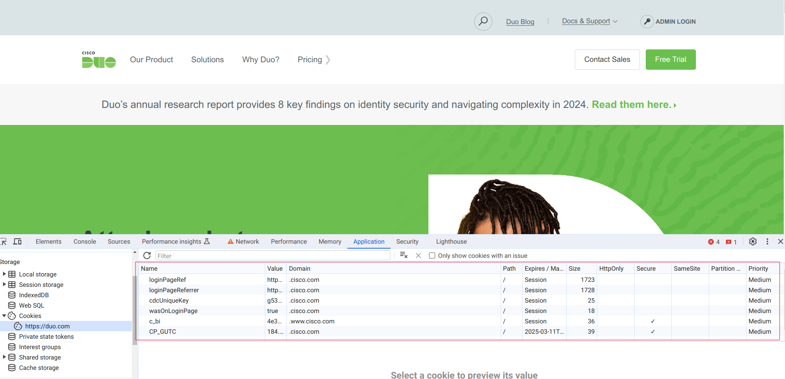

<!-- header: SCIM Intro -->
<!-- _class: title -->

# Cookies!

The cure for stateless requests
<script type="module">
  import mermaid from 'https://cdn.jsdelivr.net/npm/mermaid@10/dist/mermaid.esm.min.mjs';
  mermaid.initialize({ startOnLoad: true });
</script>

---
<!-- header: Cookies > General Overview -->
<!-- _class: info -->
### What is a cookie?
A cookie is a packet of data browsers can be asked to hold onto to give back later

It looks like this
```
userSession=abcdefabcdef; Expires=Wed, 09 Jun 2025 00:00:00 GMT
```

---

<!-- header: Cookies > General Overview -->
<!-- _class: info -->
### What is a cookie?
You can view cookies right now


---

<!-- header: Cookies > General Overview -->
<!-- _class: info -->
### What is a cookie?
* We'll get into specifics later
* The important thing is that they're persistent
* Why does that matter?


---

<!-- header: Cookies > Why?-->
<!-- _class: info -->
### Why do we even have cookies?

<div class="mermaid">
sequenceDiagram
    participant Client
    participant Server
    Client->>Server: GET /products.html
    Server->>Client: /products.html
    Client->>Server: POST /cart/add/0123
    Client->>Server: GET /cart
    
</div>

* In this situation how does the server know who the client is?


---

<!-- header: Cookies > Why? -->
<!-- _class: info -->
### Why do we even have cookies?
Let's zoom into those HTTP requests

Client fetching product page
```http
GET /products.html HTTP/1.1
Host: products.example.com
User-Agent: curl/8.6.0
Accept: */*

```
---

<style scoped>
   code { font-size: 15pt; }
</style>

<!-- header: Cookies > Why? -->
<!-- _class: info -->
### Why do we even have cookies?
Let's zoom into those HTTP requests

Server returning product page
```html
HTTP/1.1 200 Success
Location: http://products.example.com/products.html
Content-Type: text/html; charset=UTF-8
Date: Tue, 06 Feb 2024 19:40:03 GMT
Expires: Thu, 07 Mar 2024 19:40:03 GMT
Content-Length: 219
...

<HTML>
    <HEAD><meta http-equiv="content-type" content="text/html;charset=utf-8">
        <TITLE>Products</TITLE>
    </HEAD>
    <BODY>
        <!-- a bunch of product listings here ... -->
    </BODY>
</HTML>
```

---

<!-- header: Cookies > Why? -->
<!-- _class: info -->
### Why do we even have cookies?
There's nothing in either the request or the response that allows a client to identify themselves
* The TCP session only lasts for a single request/response
* The HTTP messages exchange have no identifying information
* There's no way for a server to "recognize" a client

---

<style scoped>
   code { font-size: 12pt; }
</style>

<!-- header: Cookies > State for the stateless -->
<!-- _class: info -->
### Enter: Cookies
Server returning product page with a cookie
```html
HTTP/1.1 200 Success
Location: http://products.example.com/products.html
Content-Type: text/html; charset=UTF-8
Date: Tue, 06 Feb 2024 19:40:03 GMT
Expires: Thu, 07 Mar 2024 19:40:03 GMT
Content-Length: 219
Set-Cookie: userSession=abcdefabcdef; Expires=Wed, 09 Jun 2025 00:00:00 GMT
...

<HTML>
    <HEAD><meta http-equiv="content-type" content="text/html;charset=utf-8">
        <TITLE>Products</TITLE>
    </HEAD>
    <BODY>
        <!-- a bunch of product listings here ... -->
    </BODY>
</HTML>
```
* Now the client can present that cookie back to the server to identify itself

---

### Cookie request
Client adding an item to cart with a cookie
```http
POST /cart/add/0123 HTTP/1.1
Host: products.example.com
User-Agent: curl/8.6.0
Accept: */*
Cookie: userSession=abcdefabcdef;
```
* The client can be sure a product is added to their specific cart

---

<!-- header: Cookies > How do they work? -->
<!-- _class: info -->
### How do they work?
You'll notice a few things about cookies already
* Interactions about cookies take place through headers primarily
* There's some special syntax used in these headers
* Cookies have other attributes outside of their name/value pair

---

<!-- header: Cookies > How do they work? > Syntax > Headers -->
### How do the headers work?
* `Set-Cookie` is used to create, update or delete a cookie
* `Cookie` is used to read a cookie

---

<style scoped>
   ul > code
   { font-size: 21pt; }
</style>
<!-- header: Cookies > How do they work? > Syntax > Headers -->
### `Set-Cookie` Header
* Syntax for both headers is `;` delimited
* for the `Set-Cookie` header the format is \
 `cookie_name=cookie_value; attribute1=value1; ...; attirbuteN=valueN`
* If you have to set more than one cookie you provide `Set-Cookie` multiple times

---

<!-- header: Cookies > How do they work? > Syntax > Headers -->
### `Cookie` Header
- for the `Cookie` header the format is \
 `cookie1=value1; ... ; cookieN=valueN`
* You don't really need more than one header

---

<!-- header: Cookies > How do they work? > Syntax > Attributes -->
### `Set-Cookie` Attributes
* `Domain` and `Path` decide where a cookie will be sent
* Since cookies are only meaningful within the context of a particular server or page they're not needed everywhere
* Since some are sensitive you really don't want them everywhere
* `Domain=products.example.com; Path=/`

---

<!-- header: Cookies > How do they work? > Syntax > Attributes > Path -->
### `Set-Cookie` Attributes
* `Path` restricts the cookie to just the URL unless it's `/` then it's site-wide
* `Domain` restricts the cookie to all sub-domains

---

<!-- header: Cookies > How do they work? > Syntax > Attributes > Expires -->
### `Set-Cookie` Attributes
* `Expires` resticts the cookie's validity to the given date
* To delete a cookie you set the expiration date to the past

---

<!-- header: Cookies > How do they work? -->
### Disclaimer
* This mostly ends the formal design of cookies as a state-persistance mechanism
* They were introduced between 1994 and 1998 but didn't have an RFC until 2011
* Everything we've talked about so far is in the original patent (1998)
* What follows is organic grow in response to security issues so it's messy


---

<!-- header: Cookies > Security Issues -->
### Security Issues
* Most of what makes cookies hard to use are all the security problems they've had
* If you make a mistake with a cookie it's silently dropped
 

---

<!-- header: Cookies > Security Issues -->
### Security Issues
* I don't trust my subdomain (`hostOnly`)
* Javascript (`httpOnly`)
* Insecure Transport (`secure`)
* CSRF (`sameSite`)
 

---

<!-- header: Cookies > Security Issues > Subdomains-->
### Cookies leaking into subdomains
* `example.com` may not want `bad.example.com` to see their cookies
* An attacker might also set up a malicious subdomain to siphon cookies
* `hostOnly` restricts a cookie from being visible to subdomains

---

<style scoped>
    li:nth-child(2) > code { font-size: 18pt; }
</style>
<!-- header: Cookies > Security Issues > Aside: Flags -->
### Flags
- Conventions? Nah
* `hostOnly`, `httpOnly` and `secure` are a new attribute type called "flags"
* Flags aren't a key/value pair. Instead they're just present or absent
  `userSession=abcdefabcdef; Expires=Wed, 09 Jun 2025 00:00:00 GMT; httpOnly; secure`

---

<!-- header: Cookies > Security Issues > Javascript / XSS -->
#### A full programing language in the browser?
* `document.cookie` can be used to read or modify cookies
* Coupled with Cross-Site Scripting this is a big problem.
* `httpOnly` means javascript can't access the cookie

---

<!-- header: Cookies > Security Issues > TLS -->
#### Wifi and packet sniffing
* Sniffing packets become a much bigger deal on a shared medium
* Attacks to grab packets became more sophisticated
* `secure` means you need a secure transport layer (SSL, TLS)

---

<!-- header: Cookies > Security Issues > CSRF -->
#### CSRF: The right user, the wrong content
* Cross-Site Request Forgery is what's now being addressed by major browsers
* CSRF is when an attacker tricks your browser into doing something on a different site
* An `` tag will get your browser to ask `google.com` for an image
* ... or anything
* Maybe log you out
* Maybe change your password

---

<style scoped>
    img {
        display: inline-block;
    }
</style>
<!-- header: Cookies > Security Issues > CSRF -->
#### CSRF: The right user, the wrong content
- CSRF is sneaky
* the user is authenticated 
* the transport is secure 
* the content is unknown 
* `sameSite` prevents cookies from being submitted _from_ a different site
* `Domain` prevented cookies from being submitted _to_ a different domain

---

<!-- header: Cookies > Security Issues > CSRF > `sameSite` -->
#### `sameSite` specifics
* `sameSite` isn't a flag it has values.
* `Strict` means target and origin domain _must_ match for the cookie to send
* `Lax` means only "safe" requests (GET and not from an iframe)
* `None` means no protection
* Most browsers require `sameSite=None` to have `secure`


---

<!-- header: Cookies > Security Issues > CSRF -->
#### Chrome and Third-Party Cookies
* A "third-party cookie" is one with `sameSite=None`
* Chrome is already starting to block third-party cookies

---

<!-- header: Cookies > Conclusion -->
#### Conclusion
* Cookies are a fine solution for adding state
* Cookies have some rough edges and bad error reporting
* You probably want `httpOnly`, `secure` and `sameSite=Lax` for starters

---

#### Q&A
* And now for something completely different


---

### References
Cookie Format RFC - https://datatracker.ietf.org/doc/html/rfc6265
Cookie Wikipedia Page - https://en.wikipedia.org/wiki/HTTP_cookie
"Cookie" header specification - https://developer.mozilla.org/en-US/docs/Web/HTTP/Headers/Cookie
"Set-Cookie" header specification - https://developer.mozilla.org/en-US/docs/Web/HTTP/Headers/Set-Cookie
Cookie patent - https://worldwide.espacenet.com/patent/search/family/024155035/publication/US5774670A?q=pn%3DUS5774670A
Mozilla restricts third-party cookies - https://developer.mozilla.org/en-US/blog/goodbye-third-party-cookies/
CSRF - https://en.wikipedia.org/wiki/Cross-site_request_forgery
